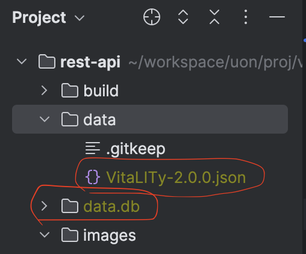

## 🛠 Developer Notes: Known Issues and Refactoring TODOs

Several files in the `service/` directory have been **modified from their original versions**, but are currently in an **incomplete or inconsistent state**. Future developers are advised to carefully review and test the logic before reuse or deployment.

### 🔧 Affected Files and Known Issues

| File               | Status     | Notes                                                        |
| ------------------ | ---------- | ------------------------------------------------------------ |
| `service/chain.py` | ✅ Modified | Chain orchestration logic may be inconsistent with `embed.py`; ensure embedding calls and result handling are unified. |
| `service/embed.py` | ✅ Modified | Embedding functions use local models (e.g., Ollama or HuggingFace), but integration may not be stable or well abstracted. |
| `service/marqo.py` | ✅ Modified | Marqo vector search works for simple cases, but advanced queries may be incompatible with current index setup. |
| `*_bak.py`         | 🟡 Original | Use these as reference points for rollback or comparison during refactoring. |

### 🚧 Refactoring Suggestions

- **Abstract embedding logic** into a unified `get_embedding(text: str)` utility with support for:
  - Ollama
  - Sentence-Transformers
  - OpenAI API (optional fallback)
- **Ensure consistent output shape** (`List[float]`) regardless of backend
- **Modularize chain-of-thought logic** in `chain.py` to follow:
  - Embed → Search → Format → Respond
- **Align Marqo search behavior** with [latest documentation](https://docs.marqo.ai/latest/), especially for tensor-based context queries

### 📌 Tips for Contributors

- All recent modifications were made by `Slian22`
- Original versions are backed up as `*_bak.py`
- When in doubt, start from `_bak.py` and rebuild step-by-step

> ✅ Please validate all changes with unit tests or sample queries before merging into mainline logic.

---

### Download Essential Files

- Download all files in this [google drive](https://drive.google.com/drive/folders/1OiiwSi8aYb0w6fh8rpTMZS7MupO3pE0S) folder. There are two files:

    - One is `VitaLITy-2.0.0.json`, This is the paper dataset. After downloading, copy this inside the `data` folder of this repository.
    - The other is `data.db.zip`, which contains information about the chromadb data set. I use this to retrieve data when performing enhancements. After downloading, please unzip it and place the `data.db` folder in the project root folder. The directory structure is as shown below.

### Setup

- Install dependencies: `pip install -r ./requirements.txt` (can make virtual environment if needed)
- Add OPENAI key to .env file. Because this is sensitive, check email/slack.
- Start: `python server.py`. Wait until you see "created query index for ada". Then you can setup and run the frontend repository.