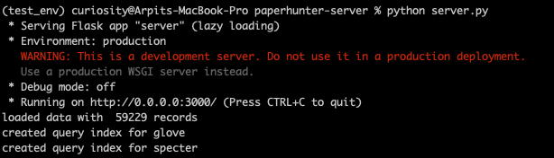

# vitaLITy - REST API

### Requirements: 
- Python 3.8+
- [Conda](https://docs.conda.io/en/latest/) *(similar to virtualenv + pip)*

### Setup
- Create a new environment: `conda create --name env_vitality_rest_api anaconda` or `conda create --name env_vitality_rest_api python=3.8` (based on specific python version)
- Activate the environment: `conda activate env_vitality_rest_api`
- Add conda-forge to the channel: `conda config --append channels conda-forge`
- Install requirements: `conda install --yes --file requirements.txt`

### Run
- Configure options pertaining to the input data source, its type in `config.py` 
- `python server.py` - wait until you see three logs: "loaded data" and "created query index for glove" and "created query index for specter"; this may take 3-4 minutes and look like the below screenshot:


- The REST-API will then be available at `http://localhost:3000`. Use this in the [frontend](https://github.com/vitality-vis/frontend)/src/components/App.tsx file as the `baseUrl` variable.


### API configuration
- GET /getPapers(): Returns all papers
- POST /getSimilarPapers(): Returns similar papers by ID, Title
    ```json
    {
        "input_data": ["An Intermittent Click Planning Model.", "Tool Extension in Human-Computer Interaction."], // [list<Title>], [list<ID>] depending on the input_type below
        "input_type": "Title", // Title, ID
        "limit": 3, // any number less than the number of papers available.
        "embedding": "glove", //glove, specter
        "dimensions": "2D" // 2D, nD
    }
    ```
    
- POST /getSimilarPapersByKeyword(): Returns similar papers by Keywords
    ```json
    {
        "input_data": ["DaTa VisUaLiSAtion"], // [list<Keywords>], case insensitive
        "limit": 3, // any number, -1 for all
    }
    ```
    
- POST /getSimilarPapersByAbstract(): Returns similar papers by Abstract and Title
    ```json
    {
    "input_data": {
        "title": "Any WIP Title", // string
        "abstract": "Any WIP abstract" // string
    },
    "limit": 3
    }
    ```

- POST /checkoutPapers(): Download a list of dictionaries (JSON) of papers by ID, Title.
    ```json
    {
        "input_data": ["An Intermittent Click Planning Model.", "Tool Extension in Human-Computer Interaction."], // [list<Title>], [list<ID>] depending on the input_type below
        "input_type": "Title" // Title, ID
    }
    ```

### Credits
vitaLITy was created by 
<a target="_blank" href="https://www.cc.gatech.edu/~anarechania3">Arpit Narechania</a>, <a target="_blank" href="https://www.karduni.com/">Alireza Karduni</a>, <a target="_blank" href="https://wesslen.netlify.app/">Ryan Wesslen</a>, and <a target="_blank" href="https://emilywall.github.io/">Emily Wall</a>.


### Citation
```bibTeX
@article{narechania2021vitality,
  title={vitaLITy: Promoting Serendipitous Discovery of Academic Literature with Transformers \& Visual Analytics},
  author={Narechania, Arpit and Karduni, Alireza and Wesslen, Ryan and Wall, Emily},
  journal={IEEE Transactions on Visualization and Computer Graphics},
  year={2021},
  doi={10.1109/TVCG.2021.3114820},
  publisher={IEEE}
}
```

### License
The software is available under the [MIT License](https://github.com/vitality-vis/rest-api/blob/master/LICENSE).


### Contact
If you have any questions, feel free to [open an issue](https://github.com/vitality-vis/rest-api/issues/new/choose) or contact [Arpit Narechania](https://www.cc.gatech.edu/~anarechania3).
